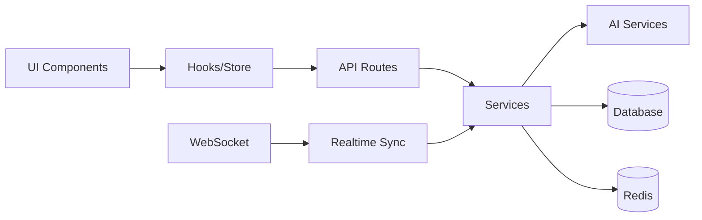

# 🎯 단순화된 아키텍처 (P0-P2 Focus)

## 📁 실용적인 디렉토리 구조

```
geulpi-calendar/
├── 📁 src/
│   ├── 📁 app/                      # Next.js App Router
│   │   ├── api/                     
│   │   │   ├── ai/                  # AI 관련 API
│   │   │   ├── calendar/            # 캘린더 CRUD
│   │   │   ├── auth/                # 인증
│   │   │   └── ws/                  # WebSocket 엔드포인트
│   │   │
│   │   ├── (dashboard)/             # 대시보드 그룹
│   │   │   ├── layout.tsx
│   │   │   ├── page.tsx
│   │   │   └── calendar/
│   │   │
│   │   └── (auth)/                  # 인증 그룹
│   │       ├── login/
│   │       └── layout.tsx
│   │
│   ├── 📁 services/                 # 핵심 서비스 로직
│   │   ├── ai/
│   │   │   ├── GeminiService.ts     # Gemini AI 통합
│   │   │   ├── NLPProcessor.ts      # 자연어 처리
│   │   │   ├── ContextManager.ts    # 컨텍스트 관리
│   │   │   ├── PatternLearner.ts    # 패턴 학습
│   │   │   └── MultimodalHandler.ts # 음성/이미지 처리
│   │   │
│   │   ├── calendar/
│   │   │   ├── EventService.ts      # 일정 관리
│   │   │   ├── SyncService.ts       # 동기화
│   │   │   ├── TeamScheduler.ts     # 팀 일정 조율
│   │   │   └── SmartScheduler.ts    # 스마트 스케줄링
│   │   │
│   │   ├── notification/
│   │   │   ├── NotificationService.ts
│   │   │   └── ProactiveAlerts.ts   # 프로액티브 알림
│   │   │
│   │   └── realtime/
│   │       ├── SocketService.ts     # WebSocket 관리
│   │       └── SyncEngine.ts        # 실시간 동기화
│   │
│   ├── 📁 lib/                      # 유틸리티 & 헬퍼
│   │   ├── db/
│   │   │   ├── prisma.ts           # Prisma 클라이언트
│   │   │   └── redis.ts            # Redis 클라이언트
│   │   │
│   │   ├── auth/
│   │   │   ├── jwt.ts              # JWT 처리
│   │   │   └── google-oauth.ts     # Google OAuth
│   │   │
│   │   ├── utils/
│   │   │   ├── date-parser.ts      # 날짜 파싱
│   │   │   ├── validators.ts       # 입력 검증
│   │   │   └── error-handler.ts    # 에러 처리
│   │   │
│   │   └── constants/
│   │       └── config.ts           # 설정 상수
│   │
│   ├── 📁 components/               # React 컴포넌트
│   │   ├── ui/                     # 기본 UI 컴포넌트
│   │   │   ├── Button.tsx
│   │   │   ├── Card.tsx
│   │   │   └── Modal.tsx
│   │   │
│   │   ├── calendar/               # 캘린더 컴포넌트
│   │   │   ├── Calendar.tsx
│   │   │   ├── EventCard.tsx
│   │   │   └── TimeSlot.tsx
│   │   │
│   │   ├── chat/                   # AI 채팅 컴포넌트
│   │   │   ├── ChatInterface.tsx
│   │   │   ├── MessageBubble.tsx
│   │   │   └── VoiceInput.tsx
│   │   │
│   │   └── shared/                 # 공유 컴포넌트
│   │       ├── Header.tsx
│   │       └── Sidebar.tsx
│   │
│   ├── 📁 hooks/                    # Custom Hooks
│   │   ├── useCalendar.ts
│   │   ├── useWebSocket.ts
│   │   ├── useAI.ts
│   │   └── useVoice.ts
│   │
│   ├── 📁 store/                    # 상태 관리 (Zustand)
│   │   ├── calendarStore.ts
│   │   ├── aiStore.ts
│   │   └── userStore.ts
│   │
│   └── 📁 types/                    # TypeScript 타입
│       ├── calendar.ts
│       ├── ai.ts
│       └── api.ts
│
├── 📁 prisma/                       # 데이터베이스
│   ├── schema.prisma
│   └── migrations/
│
├── 📁 public/                       # 정적 파일
│   └── assets/
│
├── 📁 tests/                        # 테스트
│   ├── unit/
│   ├── integration/
│   └── e2e/
│
└── 📁 docs/                         # 문서
    ├── API.md
    └── SETUP.md
```

## 🏗️ 핵심 설계 원칙

### 1. **실용적 구조**
- Next.js의 장점 최대 활용 (App Router, API Routes)
- 과도한 추상화 없이 명확한 책임 분리
- 서비스 레이어에 비즈니스 로직 집중

### 2. **확장 가능성**
```typescript
// 새 기능 추가 시 쉬운 확장
services/
  ├── ai/           // AI 기능 확장
  ├── calendar/     // 캘린더 기능 확장
  └── [new]/        // 새 모듈 추가 용이
```

### 3. **명확한 레이어링**
```
Presentation (components, app) 
    ↓
Application (services, hooks)
    ↓
Infrastructure (lib, prisma)
```

## 🔄 데이터 플로우



## 📦 핵심 모듈 설명

### 🤖 AI Services
```typescript
// services/ai/ContextManager.ts
class ContextManager {
  private conversations: Map<string, Conversation>
  private vectorDB: PineconeClient
  
  async maintainContext(sessionId: string, message: string)
  async retrieveContext(sessionId: string)
  async learnPattern(userId: string, action: Action)
}

// services/ai/PatternLearner.ts
class PatternLearner {
  async analyzeUserBehavior(userId: string)
  async predictNextAction(context: Context)
  async suggestOptimalTime(event: CalendarEvent)
}

// services/ai/MultimodalHandler.ts
class MultimodalHandler {
  async processVoice(audio: Buffer): Promise<string>
  async processImage(image: Buffer): Promise<EventData>
  async extractTextFromPDF(pdf: Buffer): Promise<string>
}
```

### 📅 Calendar Services
```typescript
// services/calendar/SmartScheduler.ts
class SmartScheduler {
  async findOptimalTime(constraints: Constraints)
  async detectConflicts(events: Event[])
  async suggestReschedule(conflict: Conflict)
  async calculateTravelTime(from: Location, to: Location)
}

// services/calendar/TeamScheduler.ts
class TeamScheduler {
  async findCommonSlots(participants: string[])
  async proposeMetingTimes(requirements: MeetingReq)
  async syncTeamCalendars(teamId: string)
}
```

### 🔔 Notification Services
```typescript
// services/notification/ProactiveAlerts.ts
class ProactiveAlerts {
  async analyzeUpcomingEvents(userId: string)
  async generateSmartReminders(event: Event)
  async detectAnomalies(schedule: Schedule)
  async suggestPreparation(event: Event)
}
```

### 🔄 Realtime Services
```typescript
// services/realtime/SyncEngine.ts
class SyncEngine {
  private ws: WebSocketServer
  
  async handleOptimisticUpdate(update: Update)
  async resolveConflict(conflict: Conflict)
  async broadcastChange(change: Change)
  async syncOfflineChanges(changes: Change[])
}
```

## 🚀 구현 우선순위

### Phase 0: 기반 구축 (2주)
```bash
✅ 현재 코드를 services/ 구조로 리팩토링
✅ TypeScript strict mode 설정
✅ 기본 테스트 환경 구축
✅ 에러 처리 강화
```

### Phase 1: 핵심 AI (4주)
```bash
📌 ContextManager 구현
📌 NLPProcessor 고도화
📌 PatternLearner 프로토타입
📌 컨텍스트 기반 대화 구현
```

### Phase 2: 실시간 & 협업 (4주)
```bash
📌 WebSocket 서버 구축
📌 실시간 동기화 구현
📌 TeamScheduler 개발
📌 ProactiveAlerts 시스템
```

### Phase 3: 지능화 (4주)
```bash
📌 MultimodalHandler (음성/이미지)
📌 SmartScheduler 고도화
📌 패턴 학습 강화
📌 예측 기능 구현
```

## 💡 기술 스택 (단순화)

### Frontend
- **Framework**: Next.js 14 (App Router)
- **State**: Zustand (단순함)
- **UI**: Tailwind CSS + shadcn/ui
- **Real-time**: Socket.io

### Backend
- **API**: Next.js API Routes
- **Database**: PostgreSQL + Prisma
- **Cache**: Redis (Upstash)
- **Queue**: Bull (필요시)

### AI/ML
- **NLP**: Gemini API
- **Voice**: Web Speech API / Whisper
- **Vector**: Pinecone (컨텍스트용)
- **OCR**: Tesseract.js

### Infrastructure
- **Hosting**: Vercel / Railway
- **Storage**: Cloudinary (이미지)
- **Monitoring**: Sentry
- **Analytics**: Posthog

## 🎯 핵심 차별점

1. **실용적 접근**
   - 과도한 엔지니어링 배제
   - Next.js 생태계 최대 활용
   - 빠른 개발과 배포

2. **점진적 확장**
   - 기본 기능부터 견고하게
   - 필요시 모듈 추가
   - 명확한 경계와 인터페이스

3. **사용자 중심**
   - 실제 필요한 기능 우선
   - 빠른 피드백 반영
   - 지속적인 개선

## 📈 성공 지표

### 3개월 목표
- ✅ 자연어 이해 정확도 85%
- ✅ 응답 시간 < 500ms
- ✅ 기본 팀 협업 기능
- ✅ 음성 입력 지원

### 6개월 목표
- ✅ 패턴 학습 정확도 80%
- ✅ 프로액티브 제안 수락률 60%
- ✅ 멀티모달 입력 완성
- ✅ 스마트 스케줄링 구현

## 🔑 핵심 성공 요소

1. **단순함 유지**: 복잡한 것은 나중에
2. **사용자 피드백**: 빠른 반복과 개선
3. **안정성 우선**: 기본 기능의 견고함
4. **점진적 개선**: 작은 승리들의 축적