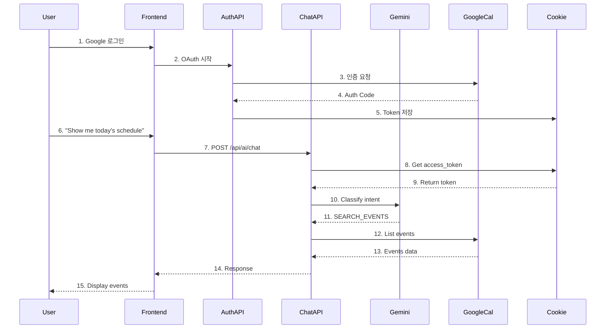

# Geulpi Calendar System 상호작용 분석

## 📊 시스템 아키텍처 및 데이터 플로우

```mermaid
graph TB
    subgraph "Frontend (Next.js)"
        U[User] --> LC[Login Component]
        U --> AC[AI Chat Interface]
        AC --> ACF[Fetch /api/ai/chat]
    end
    
    subgraph "Backend API Routes"
        LC --> AUTH[/api/auth/login]
        AUTH --> GCALLBACK[/api/auth/callback]
        ACF --> AICHAT[/api/ai/chat]
    end
    
    subgraph "External Services"
        AUTH --> GAUTH[Google OAuth 2.0]
        GAUTH --> GCALLBACK
        AICHAT --> GEMINI[Gemini API]
        AICHAT --> GCAL[Google Calendar API]
    end
    
    subgraph "Token Storage"
        GCALLBACK --> COOKIE[Cookie Storage]
        COOKIE --> |access_token| AICHAT
        COOKIE --> |refresh_token| AICHAT
    end
    
    subgraph "AI Processing"
        AICHAT --> AIR[AI Router]
        AIR --> IC[Intent Classification]
        IC --> |SEARCH_EVENTS| ES[Event Search Handler]
        ES --> GCAL
    end
```

## 🔍 현재 시스템의 문제점 분석

### 1. **인증 토큰 흐름**
- ✅ **정상**: Google OAuth로 로그인 → access_token이 쿠키에 저장됨
- ⚠️ **문제점**: 
  - Vercel 프로덕션에서 쿠키가 제대로 설정되지 않을 수 있음
  - `sameSite: 'lax'` 설정이 크로스 도메인 요청에서 문제 발생 가능

### 2. **API 호출 체인**
```
User Input → AI Chat API → Intent Classification → Event Search → Google Calendar API
```

**각 단계별 문제점:**

#### a) AI Chat API (`/api/ai/chat/route.ts`)
- **문제**: `cookies().get('access_token')` 실패 가능
- **원인**: 
  - Vercel의 서버리스 함수 환경에서 쿠키 접근 제한
  - 프로덕션 환경의 보안 정책

#### b) Intent Classification
- **현재 상태**: "show me the schedule of today" → CONVERSATION으로 잘못 분류
- **원인**: Gemini API가 의도를 제대로 파악하지 못함
- **해결책 필요**: 더 명확한 프롬프트 또는 fallback 로직

#### c) Google Calendar API 호출
- **문제**: access_token이 유효하지 않거나 만료됨
- **원인**: 토큰 갱신 로직 부재

## 🔧 개선 방안

### 1. **토큰 관리 개선**
```typescript
// 토큰 리프레시 로직 추가
async function refreshAccessToken(refreshToken: string) {
  const oauth2Client = getGoogleAuthClient();
  oauth2Client.setCredentials({ refresh_token: refreshToken });
  const { credentials } = await oauth2Client.refreshAccessToken();
  return credentials.access_token;
}
```

### 2. **Intent Classification 강화**
```typescript
// Fallback 로직 추가
if (message.toLowerCase().includes('schedule') || 
    message.toLowerCase().includes('calendar') ||
    message.toLowerCase().includes('event')) {
  // 강제로 SEARCH_EVENTS로 처리
  return { type: 'SEARCH_EVENTS', confidence: 0.9, parameters: {} };
}
```

### 3. **디버깅 정보 추가**
```typescript
// 각 단계별 상태 로깅
console.log('[Step 1] Token exists:', !!accessToken);
console.log('[Step 2] Intent classified as:', intent.type);
console.log('[Step 3] Calendar API response:', events.data);
```

## 📈 상호작용 시퀀스 다이어그램



## 🚨 주요 실패 지점

1. **Step 8-9**: 쿠키에서 토큰을 가져오지 못함
   - Vercel 환경에서 httpOnly 쿠키 접근 문제
   
2. **Step 11**: Intent가 CONVERSATION으로 잘못 분류
   - Gemini API 프롬프트 개선 필요
   
3. **Step 12**: Google Calendar API 인증 실패
   - 토큰 만료 또는 스코프 부족

## 🛠️ 즉각적인 해결책

### 1. 토큰 저장 방식 변경
```typescript
// 옵션 1: Supabase에 토큰 저장
// 옵션 2: Next.js 세션에 저장
// 옵션 3: 클라이언트 localStorage (보안 주의)
```

### 2. Intent Classification 우회
```typescript
// 특정 키워드가 있으면 직접 Calendar API 호출
const calendarKeywords = ['schedule', 'calendar', 'event', 'meeting', 'appointment'];
const shouldSearchEvents = calendarKeywords.some(keyword => 
  message.toLowerCase().includes(keyword)
);
```

### 3. 에러 핸들링 강화
```typescript
try {
  const calendar = getCalendarClient(accessToken);
  const events = await calendar.events.list({...});
} catch (error) {
  if (error.code === 401) {
    // 토큰 갱신 시도
    const newToken = await refreshAccessToken(refreshToken);
    // 재시도
  }
}
```

## 📝 테스트 체크리스트

- [ ] 로컬 환경에서 정상 작동 확인
- [ ] Vercel 프로덕션에서 쿠키 설정 확인
- [ ] access_token 유효성 확인
- [ ] Gemini API 응답 확인
- [ ] Google Calendar API 권한 스코프 확인
- [ ] 토큰 만료 시 갱신 로직 확인