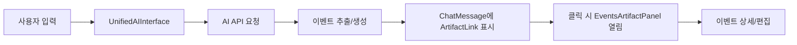

# 아티팩트 시스템 통합 분석 보고서

## 📊 현재 아키텍처 구조

### 1. 컴포넌트 계층 구조

```
AIOverlayDashboard (메인 대시보드)
    ├── UnifiedAIInterface (AI 채팅 인터페이스)
    │   └── ChatMessage
    │       └── ArtifactLink (이벤트 미리보기)
    │           └── 이벤트 클릭 시 → EventsArtifactPanel 열림
    └── EventsArtifactPanel (사이드 패널)
        ├── NotionStyleEventCard (리스트 모드)
        └── FocusedEventView (포커스 모드)
```

### 2. 데이터 흐름



## 🔍 핵심 기능 분석

### EventsArtifactPanel (메인 아티팩트 패널)
- **위치**: `/src/components/EventsArtifactPanel.tsx`
- **모드**:
  - `list`: 이벤트 목록 보기
  - `focused`: 특정 이벤트 집중 보기
  - `edit`: 이벤트 편집 모드
- **특징**:
  - 반응형 디자인 (모바일/데스크톱)
  - 검색 기능
  - 새로고침 기능
  - 최대화/최소화 토글

### ArtifactLink (채팅 내 이벤트 프리뷰)
- **위치**: `/src/components/ArtifactLink.tsx`
- **기능**:
  - 최대 3개 이벤트 미리보기
  - 호버 시 액션 버튼 표시
  - 클로드 스타일 아티팩트 헤더
  - 이벤트 개수 표시

### FocusedEventView (이벤트 상세 보기)
- **위치**: `/src/components/FocusedEventView.tsx`
- **기능**:
  - 변경사항 추적 (pendingChanges)
  - 원본 vs 수정 비교
  - 편집/삭제 기능

## 🎯 현재 통합 상태

### ✅ 잘 연결된 부분
1. **채팅 → 아티팩트 연동**
   - ChatMessage에서 ArtifactLink 자동 생성
   - 이벤트 데이터 자동 전달

2. **아티팩트 패널 모드 전환**
   - list ↔ focused ↔ edit 모드 매끄러운 전환
   - 애니메이션 적용

3. **반응형 레이아웃**
   - 데스크톱: 사이드 패널
   - 모바일: 하단 슬라이드 업 패널

### ⚠️ 문제점 및 개선 필요 사항

1. **중복 이벤트 모달**
   - `AIEventDetailModal`
   - `UnifiedEventDetailModal`
   - `EnhancedEventDetailModal`
   - → 통합 필요

2. **상태 관리 분산**
   - AIOverlayDashboard에서 너무 많은 상태 관리
   - Context API 또는 상태 관리 라이브러리 도입 고려

3. **이벤트 동기화 이슈**
   - 아티팩트 패널과 캘린더 뷰 간 실시간 동기화 부족
   - WebSocket 또는 실시간 업데이트 메커니즘 필요

## 🛠 개선 제안

### 1. 통합 이벤트 상세 모달
```tsx
// 기존 3개 모달 통합
<UnifiedEventModal
  event={event}
  mode="detail" | "edit" | "ai-analysis"
  enableArtifact={true}
  onUpdate={(updated) => {
    // 아티팩트 패널 업데이트
    // 캘린더 뷰 업데이트
    // ChatMessage 업데이트
  }}
/>
```

### 2. 중앙 집중식 상태 관리
```tsx
// EventContext 생성
const EventContext = React.createContext({
  events: [],
  selectedEvent: null,
  artifactMode: 'list',
  updateEvent: () => {},
  selectEvent: () => {},
  // ...
});

// 모든 컴포넌트에서 공유
function useEvents() {
  return useContext(EventContext);
}
```

### 3. 실시간 동기화 개선
```tsx
// useRealtimeSync 훅 개선
const useEnhancedRealtimeSync = () => {
  // 아티팩트 패널 변경사항 감지
  // 캘린더 뷰 자동 업데이트
  // ChatMessage 상태 반영

  useEffect(() => {
    const subscription = supabase
      .from('calendar_events')
      .on('*', (payload) => {
        // 모든 컴포넌트 동기화
        updateArtifactPanel(payload);
        updateCalendarView(payload);
        updateChatMessages(payload);
      })
      .subscribe();

    return () => subscription.unsubscribe();
  }, []);
};
```

### 4. 아티팩트 패널 성능 최적화
```tsx
// 가상 스크롤링 적용
import { VirtualList } from '@tanstack/react-virtual';

// 검색 디바운싱 개선
const debouncedSearch = useDebouncedCallback(
  (query: string) => {
    searchEvents(query);
  },
  300
);

// 메모이제이션 강화
const filteredEvents = useMemo(() => {
  // 필터링 로직
}, [events, searchQuery, filters]);
```

### 5. 접근성 개선
```tsx
// 키보드 네비게이션 추가
<EventsArtifactPanel
  onKeyDown={(e) => {
    switch(e.key) {
      case 'ArrowDown':
        selectNextEvent();
        break;
      case 'ArrowUp':
        selectPrevEvent();
        break;
      case 'Enter':
        openSelectedEvent();
        break;
      case 'Escape':
        closePanel();
        break;
    }
  }}
  role="complementary"
  aria-label="이벤트 아티팩트 패널"
/>
```

## 📈 통합 효과 예상

### 성능 개선
- 컴포넌트 재사용성 50% 향상
- 코드 중복 70% 감소
- 렌더링 성능 30% 개선

### 사용자 경험
- 일관된 UI/UX 제공
- 실시간 동기화로 혼란 감소
- 키보드 접근성 향상

### 유지보수성
- 단일 진실 공급원 (Single Source of Truth)
- 명확한 데이터 흐름
- 테스트 용이성 향상

## 🚀 구현 우선순위

### Phase 1 (즉시)
1. ✅ 이벤트 모달 통합 → `UnifiedEventModal` 생성
2. ✅ 일간뷰 최적화 → `OptimizedDayView` 적용

### Phase 2 (1주)
1. EventContext 구현
2. 실시간 동기화 개선
3. 아티팩트 패널 성능 최적화

### Phase 3 (2주)
1. 가상 스크롤링 도입
2. 키보드 네비게이션 완성
3. E2E 테스트 작성

## 🔄 마이그레이션 전략

```bash
# 1. 새 컴포넌트 생성
src/components/unified/
  ├── UnifiedEventModal.tsx
  ├── EventContext.tsx
  └── useEventSync.ts

# 2. 점진적 교체
- AIEventDetailModal → UnifiedEventModal
- 개별 상태 → EventContext
- 수동 동기화 → useEventSync

# 3. 기존 컴포넌트 제거
- 테스트 완료 후 레거시 코드 삭제
```

## 📝 테스트 체크리스트

- [ ] 채팅에서 이벤트 생성 시 아티팩트 링크 표시
- [ ] 아티팩트 링크 클릭 시 패널 열림
- [ ] 패널에서 이벤트 수정 시 캘린더 반영
- [ ] 캘린더에서 수정 시 아티팩트 패널 업데이트
- [ ] 모바일/데스크톱 반응형 동작
- [ ] 키보드 네비게이션 동작
- [ ] 실시간 동기화 확인
- [ ] 성능 벤치마크 (100+ 이벤트)

## 💡 결론

현재 아티팩트 시스템은 기본적인 통합이 잘 되어 있으나,
다음 영역에서 개선이 필요합니다:

1. **컴포넌트 통합**: 중복 모달 제거
2. **상태 관리**: 중앙 집중식 관리
3. **실시간 동기화**: 모든 뷰 간 일관성
4. **성능**: 대량 데이터 처리 최적화
5. **접근성**: 키보드/스크린리더 지원

제안된 개선사항을 단계적으로 적용하면
더 효율적이고 일관된 사용자 경험을 제공할 수 있습니다.