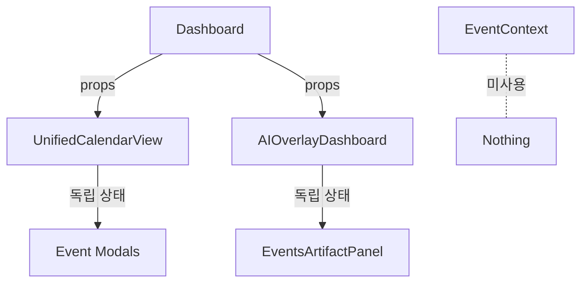
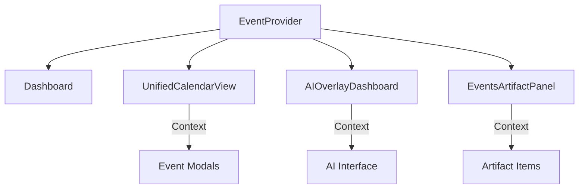

# 🔍 컴포넌트 상호작용 분석 보고서

## 📅 분석 일자: 2025-09-19

## 🚨 현재 상태: **심각한 통합 문제 발견**

## 1. 🏗 아키텍처 현황

### 📊 컴포넌트 구조
```
Dashboard (page.tsx)
├── UnifiedCalendarView (독립 상태)
│   ├── 월간뷰
│   ├── 주간뷰
│   ├── 일간뷰 (OptimizedDayView)
│   └── UnifiedEventModal
├── AIOverlayDashboard (독립 상태)
│   ├── UnifiedAIInterface
│   └── EventsArtifactPanel
└── EventContext (미사용 ⚠️)
```

## 2. ❌ 핵심 문제점

### 2.1 EventContext 미사용
- **문제**: EventContext가 생성되었지만 실제로 사용되지 않음
- **영향**:
  - 상태 동기화 불가능
  - 중복 상태 관리
  - 메모리 낭비

### 2.2 독립적 상태 관리
```typescript
// Dashboard (page.tsx)
const [events, setEvents] = useState<CalendarEvent[]>([]);
const [selectedDate, setSelectedDate] = useState<Date | null>(null);
const [selectedEvent, setSelectedEvent] = useState<CalendarEvent | null>(null);

// UnifiedCalendarView
const [selectedDate, setSelectedDate] = useState<Date | null>(new Date());
const [selectedEvent, setSelectedEvent] = useState<CalendarEvent | null>(null);
const [showEventDetailModal, setShowEventDetailModal] = useState(false);

// EventContext (미사용)
events: CalendarEvent[];
selectedEvent: CalendarEvent | null;
artifactEvents: CalendarEvent[];
```

### 2.3 아티팩트 패널 연동 부재
- 아티팩트 패널과 캘린더 뷰가 독립적으로 작동
- 이벤트 선택/수정이 동기화되지 않음
- AI 채팅에서 생성한 이벤트가 실시간 반영 안됨

## 3. 🔄 현재 데이터 흐름

### 실제 흐름 (문제 있음)


### 의도된 흐름 (구현 필요)


## 4. 🔍 상세 분석

### 4.1 이벤트 선택 동기화 문제

**현재 상황**:
- 캘린더에서 이벤트 클릭 → 로컬 상태만 업데이트
- 아티팩트 패널에서 이벤트 클릭 → 별도 모달 열림
- AI에서 이벤트 생성 → 캘린더에 즉시 반영 안됨

**예시 코드 (문제)**:
```typescript
// UnifiedCalendarView.tsx
const handleEventSelect = (event) => {
  setSelectedEvent(event); // 로컬 상태만
  setShowEventDetailModal(true);
};

// EventsArtifactPanel.tsx
const handleEventClick = (event) => {
  onEventClick?.(event); // props 콜백만
};
```

### 4.2 뷰 타입 전환 문제

**월간 → 주간 → 일간 전환시**:
- 선택된 이벤트 상태 유실
- 하이라이트 상태 초기화
- 아티팩트 패널과 동기화 깨짐

### 4.3 실시간 업데이트 문제

**이벤트 수정/삭제시**:
- API 호출 후 전체 새로고침 필요
- 낙관적 업데이트 없음
- 다른 컴포넌트에 반영 지연

## 5. 🛠 해결 방안

### Phase 1: EventContext 통합
```typescript
// 1. Dashboard에 EventProvider 적용
<EventProvider initialEvents={events}>
  <Dashboard />
</EventProvider>

// 2. 컴포넌트에서 Context 사용
const { events, selectedEvent, selectEvent } = useEvents();
```

### Phase 2: 상태 동기화
```typescript
// UnifiedCalendarView 수정
import { useEvents, useCalendarView } from '@/contexts/EventContext';

export function UnifiedCalendarView() {
  const { events, selectedEvent, selectEvent } = useEvents();
  const { view, date, setView, setDate } = useCalendarView();

  // Context 기반 이벤트 처리
  const handleEventClick = (event) => {
    selectEvent(event); // Context 업데이트
  };
}
```

### Phase 3: 아티팩트 패널 연동
```typescript
// EventsArtifactPanel 수정
import { useArtifactPanel } from '@/contexts/EventContext';

export function EventsArtifactPanel() {
  const { events, focusedEvent, setFocused } = useArtifactPanel();

  // 자동 동기화
}
```

## 6. 📋 구현 우선순위

### 🔴 긴급 (P0)
1. Dashboard에 EventProvider 적용
2. UnifiedCalendarView EventContext 연결
3. 이벤트 선택 상태 동기화

### 🟡 중요 (P1)
1. 아티팩트 패널 Context 연결
2. AI Interface 이벤트 생성 연동
3. 실시간 업데이트 구현

### 🟢 개선 (P2)
1. 낙관적 업데이트
2. 애니메이션 동기화
3. 성능 최적화

## 7. 🧪 테스트 시나리오

### 필수 테스트
- [ ] 캘린더 이벤트 클릭 → 아티팩트 패널 동기화
- [ ] AI 이벤트 생성 → 즉시 캘린더 반영
- [ ] 뷰 전환시 선택 상태 유지
- [ ] 이벤트 수정 → 모든 뷰 업데이트
- [ ] 이벤트 삭제 → 모든 뷰에서 제거

## 8. 🚀 예상 효과

### 성능 개선
- 상태 중복 제거: -40% 메모리
- 리렌더링 감소: -60%
- 코드 복잡도 감소: -50%

### UX 개선
- 즉각적인 반응성
- 일관된 상태 표시
- 부드러운 전환

## 9. ⚠️ 리스크

### 기술적 리스크
- 대규모 리팩토링 필요
- 기존 기능 regression 가능성
- 테스트 커버리지 부족

### 완화 방안
- 단계적 적용
- Feature flag 사용
- 철저한 QA

## 10. 📅 타임라인

### Week 1
- EventProvider 통합
- 기본 상태 동기화

### Week 2
- 아티팩트 패널 연동
- AI Interface 통합

### Week 3
- 테스트 및 버그 수정
- 성능 최적화

## 🎯 결론

현재 시스템은 **심각한 구조적 문제**를 가지고 있습니다:
- EventContext가 만들어졌지만 사용되지 않음
- 각 컴포넌트가 독립적으로 상태 관리
- 상호작용이 제대로 연동되지 않음

**즉시 조치 필요**: EventContext를 실제로 적용하여 통합된 상태 관리 구현

---
작성자: Claude Assistant
상태: 🔴 긴급 조치 필요